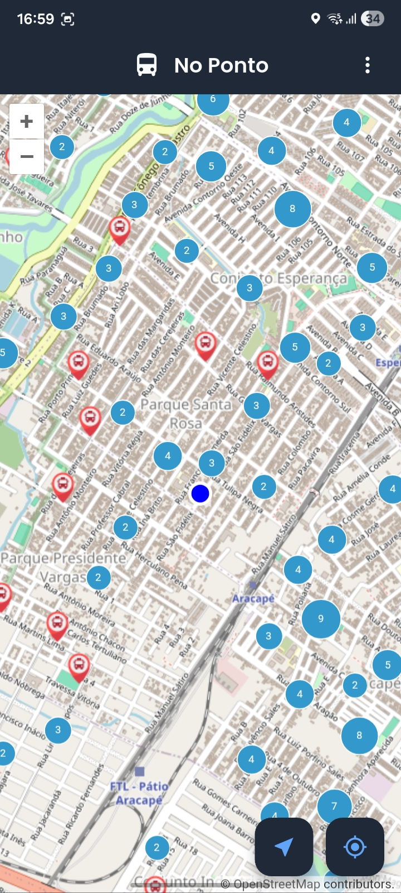
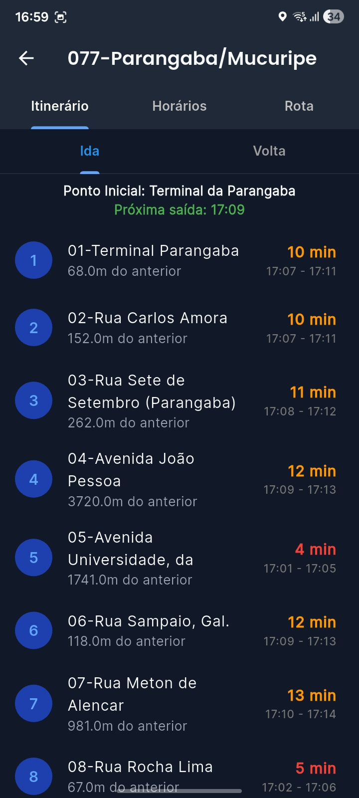

# No Ponto - Fortaleza

Aplicativo mobile de mobilidade urbana desenvolvido em Flutter para consulta de linhas, horários, itinerários e planejamento de viagens de ônibus em Fortaleza.

O projeto utiliza dados públicos da ETUFOR e OpenStreetMap para fornecer informações em tempo real sobre o transporte coletivo da cidade.

---

## Funcionalidades

### Mobilidade Urbana
- Visualização de paradas em mapa interativo
- Consulta de linhas de ônibus
- Visualização completa de itinerários
- Horários atualizados por linha
- Visualização da rota da linha no mapa
- Rastreamento GPS do usuário
- Linhas próximas em raio de até 200m
- Favoritos salvos localmente
- Planejamento de viagens entre origem e destino
- Sugestão automática de rotas utilizando grafos e algoritmo de Dijkstra
- Notificações de chegada de ônibus em ruas/paradas específicas

---

## Tecnologias Utilizadas

### Mobile
- Flutter
- Dart

### APIs e Dados
- ETUFOR Open API
- OpenStreetMap
- Nominatim API

### Algoritmos
- Grafos
- Dijkstra Shortest Path Algorithm

---

## APIs Utilizadas

### ETUFOR
```txt
http://gistapis.etufor.ce.gov.br:8081/api/linhas/
http://gistapis.etufor.ce.gov.br:8081/api/itinerario/{idLinha}
http://gistapis.etufor.ce.gov.br:8081/api/horarios/{idLinha}?data=YYYYMMDD
http://gistapis.etufor.ce.gov.br:8081/api/logradouros/
http://gistapis.etufor.ce.gov.br:8081/api/LinhasDologradouro/{idLogradouro}
````

### Geocoding

```txt
https://nominatim.openstreetmap.org/search?q={query}&format=json&limit=1
```

---

## Planejador de Rotas

O sistema de planejamento de viagens foi desenvolvido utilizando estruturas de grafos e o algoritmo de Dijkstra para calcular o melhor trajeto possível entre origem e destino.

A lógica considera:

* conexões entre linhas
* proximidade entre paradas
* tempo estimado
* menor custo de deslocamento

Essa foi a parte mais complexa do projeto devido à modelagem do grafo de transporte urbano e ao cálculo eficiente das rotas.

---

## Recursos Offline

Mesmo sem conexão, o aplicativo mantém parcialmente algumas funcionalidades:

* visualização do mapa
* paradas carregadas anteriormente
* linhas associadas às paradas cacheadas

---

## Screenshots

### Mapa de Paradas



### Itinerário da Linha



### Lista de Linhas


### Linhas Próximas


---

## Estrutura do Projeto

```txt
lib/
├── core/
├── models/
├── services/
├── screens/
├── widgets/
├── algorithms/
└── utils/
```

---

## Objetivo do Projeto

O projeto foi desenvolvido como aplicação de portfólio com foco em:

* algoritmos de grafos
* geolocalização
* mapas interativos
* consumo de APIs públicas
* arquitetura mobile
* resolução de problemas reais de mobilidade urbana

---

## Status

Projeto finalizado.

---

## Observações

Este aplicativo utiliza dados públicos disponibilizados pela ETUFOR e serviços do OpenStreetMap.

O projeto não possui vínculo oficial com órgãos públicos ou operadores de transporte.

---

## Autor

Henrique
GitHub: https://github.com/henriqu3x

